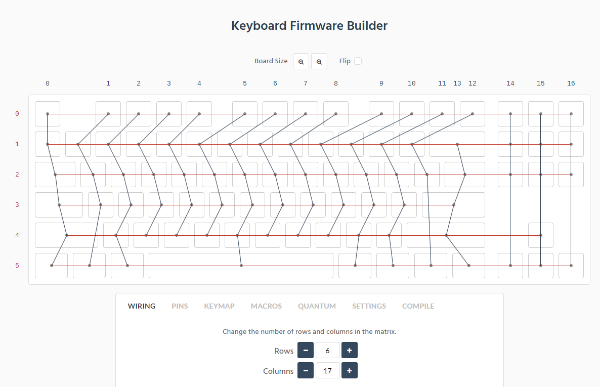

# Keychron K1 SE RGB Optical ANSI

Extremely similar to Keychron K3. Very similar to K4 as well, in terms of pins/wiring.

Not yet finished or verified, use this information at your own risk.

## Chips

Main chip has markings sanded off, but based on the K1 SE firmware update tool it appears to be an SN32F24xB. Firmware file is named `SN32F240B_32.hex`, although it seems more likely the chip is the SN32F248B.

Bluetooth chip is Cypress CYW20730 A2KFBG.

Charge IC is TP4056.

## Key Matrix

[Keyboard Layout](http://www.keyboard-layout-editor.com/##@_backcolor=#2a242e&name=Keychron%20K1%20SE&switchMount=cherry&plate:true;&@_c=#ba3113&t=#b3b3b3&p=OEM%20R4&a:5;&=esc&_c=#cccccc&t=#194bff%0A#194bff%0A#8a8a8a%0A#8a8a8a%0A%0A%0A#194bff%0A#8a8a8a%0A#8a8a8a%0A%0A#8a8a8a&p=&a:4&fa@:1&:1&:0&:0&:0&:0&:0&:0&:1&:0&:1;&d:true;&=%3Ci%20class/='fa%20fa-circle'%3E%3C//i%3E%0A%3Ci%20class/='fa%20fa-circle'%3E%3C//i%3E%0A%0A%0A%0A%0A%0A%0Acaps%0A%0ABT&_c=#44404a&t=#a6a6a6&p=OEM%20R4&a:5&f:3;&=%3Ci%20class/='kb%20kb-Unicode-Screen-Dim'%3E%3C//i%3E%0AF1&_f:3;&=%3Ci%20class/='kb%20kb-Unicode-Screen-Bright'%3E%3C//i%3E%0AF2&_f:3;&=%0AF3&_f:3;&=%0AF4&_x:0.5&c=#534d5c&f:3;&=%0AF5&_f:3;&=%0AF6&_fa@:6;;&=%3Ci%20class/='fa%20fa-backward'%3E%3C//i%3E%0AF7&_fa@:4;;&=%3Ci%20class/='fa%20fa-play'%3E%3C//i%3E%3Ci%20class/='fa%20fa-pause'%3E%3C//i%3E%0AF8&_x:0.5&c=#44404a&fa@:5;;&=%3Ci%20class/='fa%20fa-forward'%3E%3C//i%3E%0AF9&_fa@:6;;&=%3Ci%20class/='fa%20fa-volume-off'%3E%3C//i%3E%0AF10&=%3Ci%20class/='fa%20fa-volume-down'%3E%3C//i%3E%0AF11&=%3Ci%20class/='fa%20fa-volume-up'%3E%3C//i%3E%0AF12&_x:0.25&c=#534d5c&f:3;&=print%20screen&_f:3;&=voice%20cmd&_c=#ba3113&t=#b3b3b3&f:3;&=%3Ci%20class/='fa%20fa-lightbulb-o'%3E%3C//i%3E;&@_c=#534d5c&t=#a6a6a6&f:3;&=%60%20~&_c=#44404a&a:4&fa@:6&:0&:0&:1;;&=%0A%0A%0ABT1%0A%0A%0A%0A%0A1%20!&=%0A%0A%0ABT2%0A%0A%0A%0A%0A2%20/@&=%0A%0A%0ABT3%0A%0A%0A%0A%0A3%20#&_a:5&f:3;&=4%20$&_f:3;&=5%20%25&_f:3;&=6%20%5E&_f:3;&=7%20/&&_f:3;&=8%20*&_f:3;&=9%20(&_f:3;&=0%20)&_f:3;&=-%20/_&_f:3;&=/=%20+&_c=#534d5c&f:7&w:2;&=%3Ci%20class/='kb%20kb-Arrows-Left'%3E%3C//i%3E&_x:0.25&f:3;&=ins&=home&_a:4;&=page%20up;&@_p=OEM%20R3&a:5&w:1.5;&=tab&_c=#44404a;&=Q&=W&=E&=R&=T&=Y&=U&=I&=O&=P&=%5B%20%7B&=%5D%20%7D&_c=#534d5c&w:1.5;&=%5C%20%7C&_x:0.25&p=OEM%20R4;&=del&=end&_a:4;&=page%20down;&@_p=OEM%20R2&a:5&w:1.75;&=caps&_c=#44404a;&=A&=S&=D&_n:true;&=F&=G&=H&_n:true;&=J&=K&=L&=/;%20/:&='%20%22&_c=#534d5c&f:7&w:2.25;&=%3Ci%20class/='kb%20kb-Return-2'%3E%3C//i%3E;&@_p=OEM%20R1&f:3&w:2.25;&=shift&_c=#44404a;&=Z&=X&=C&=V&=B&=N&=M&=,%20%3C&=.%20%3E&=//%20?&_c=#534d5c&w:2.75;&=shift&_x:1.25&c=#44404a&n:true;&=%3Ci%20class/='fa%20fa-angle-up'%3E%3C//i%3E;&@_c=#534d5c&w:1.25;&=control&_w:1.25;&=win&_w:1.25;&=alt&_c=#44404a&p=OEM%20SPACE&w:6.25;&=/&mdash/;/&mdash/;/&mdash/;/&mdash/;/&mdash/;&_c=#534d5c&p=OEM%20R1&w:1.25;&=alt&_w:1.25;&=win&_w:1.25;&=fn&_w:1.25;&=control&_x:0.25&c=#44404a;&=%3Ci%20class/='fa%20fa-angle-left'%3E%3C//i%3E&=%3Ci%20class/='fa%20fa-angle-down'%3E%3C//i%3E&=%3Ci%20class/='fa%20fa-angle-right'%3E%3C//i%3E)

## MCU Diagram - Keyboard Matrix

| --- | col | C0 | C1 | C2 | C3 | C4 | C5 | C6 | C7 | C8 | C9 | C10 | C11 | C12 | C13 | C14 | C15 | C16 |
| --- | --- | -- | -- | -- | -- | -- | -- | -- | -- | -- | -- | --- | --- | --- | --- | --- | --- | --- |
| row | pin | 25 | 26 | 27 | 28 | 29 | 30 | 31 | 32 | 34 | 35 | 36  | 37  | 38  | 39  | 40  | 41  | 42  |
| R0  | 64  |    |    |    |    |    |    |    |    |    |    |     |     |     |     |     |     |     |
| R1  | 63  |    |    |    |    |    |    |    |    |    |    |     |     |     |     |     |     |     |
| R2  | 62  |    |    |    |    |    |    |    |    |    |    |     |     |     |     |     |     |     |
| R3  | 61  |    |    |    |    |    |    |    |    |    |    |     |     |     |     |     |     |     |
| R4  | 60  |    |    |    |    |    |    |    |    |    |    |     |     |     |     |     |     |     |
| R5  | 59  |    |    |    |    |    |    |    |    |    |    |     |     |     |     |     |     |     |

Column drivers are QX1 through to QX17. Row drivers are QQ1 through to QQ6.

## MCU Diagram - LED Matrix

|   g  |   b  |   r  |  --- |  --- |  --- | col | C0 | C1 | C2 | C3 | C4 | C5 | C6 | C7 | C8 | C9 | C10 | C11 | C12 | C13 | C14 | C15 | C16 |
|  --- |  --- |  --- |  --- |  --- |  --- | --- | -- | -- | -- | -- | -- | -- | -- | -- | -- | -- | --- | --- | --- | --- | --- | --- | --- |
|  ch1 |  ch2 |  ch3 |  pin |  pin |  pin | pin | 25 | 26 | 27 | 28 | 29 | 30 | 31 | 32 | 34 | 35 | 36  | 37  | 38  | 39  | 40  | 41  | 42  |
|  Q13 |  Q7  |  Q1  |  01  |  02  |  04  | --- | -- | -- | -- | -- | -- | -- | -- | -- | -- | -- | --- | --- | --- | --- | --- | --- | --- |
|  Q14 |  Q8  |  Q2  |  05  |  06  |  07  | --- | -- | -- | -- | -- | -- | -- | -- | -- | -- | -- | --- | --- | --- | --- | --- | --- | --- |
|  Q15 |  Q9  |  Q3  |  08  |  09  |  10  | --- | -- | -- | -- | -- | -- | -- | -- | -- | -- | -- | --- | --- | --- | --- | --- | --- | --- |
|  Q16 |  Q10 |  Q4  |  11  |  12  |  13  | --- | -- | -- | -- | -- | -- | -- | -- | -- | -- | -- | --- | --- | --- | --- | --- | --- | --- |
|  Q17 |  Q11 |  Q5  |  14  |  15  |  47  | --- | -- | -- | -- | -- | -- | -- | -- | -- | -- | -- | --- | --- | --- | --- | --- | --- | --- |
|  Q18 |  Q12 |  Q6  |  50  |  49  |  48  | --- | -- | -- | -- | -- | -- | -- | -- | -- | -- | -- | --- | --- | --- | --- | --- | --- | --- |

## MCU Diagram - Mode Switches

- (Bluetooth / Off / Cable) Mode: pin 57
- (Windows-Android / Mac-iOS) Mode: pin 58

## MCU-Diagram - Status LED Indicators

- Bluetooth: pin 45
- Num Lock: pin 51
